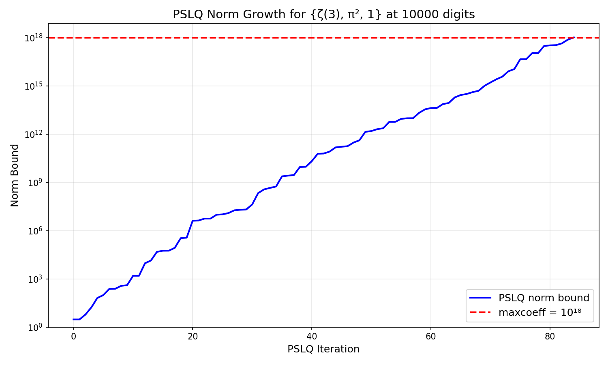
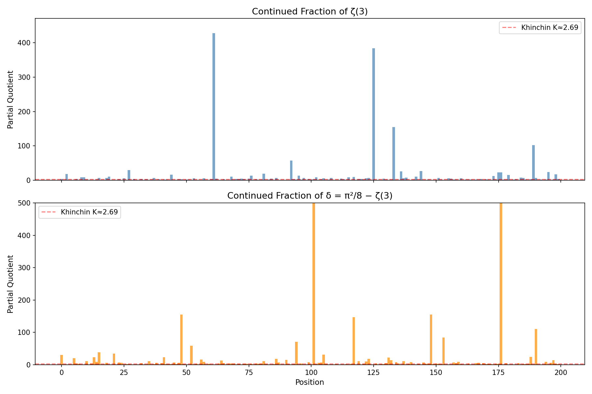
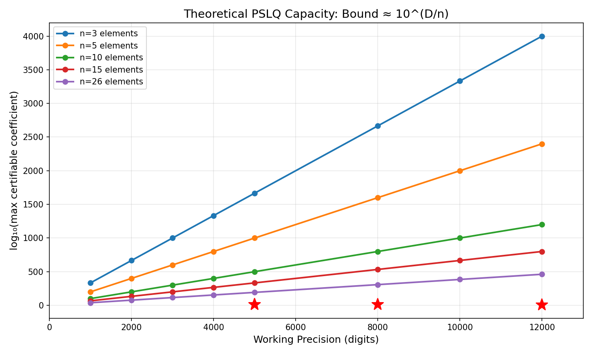
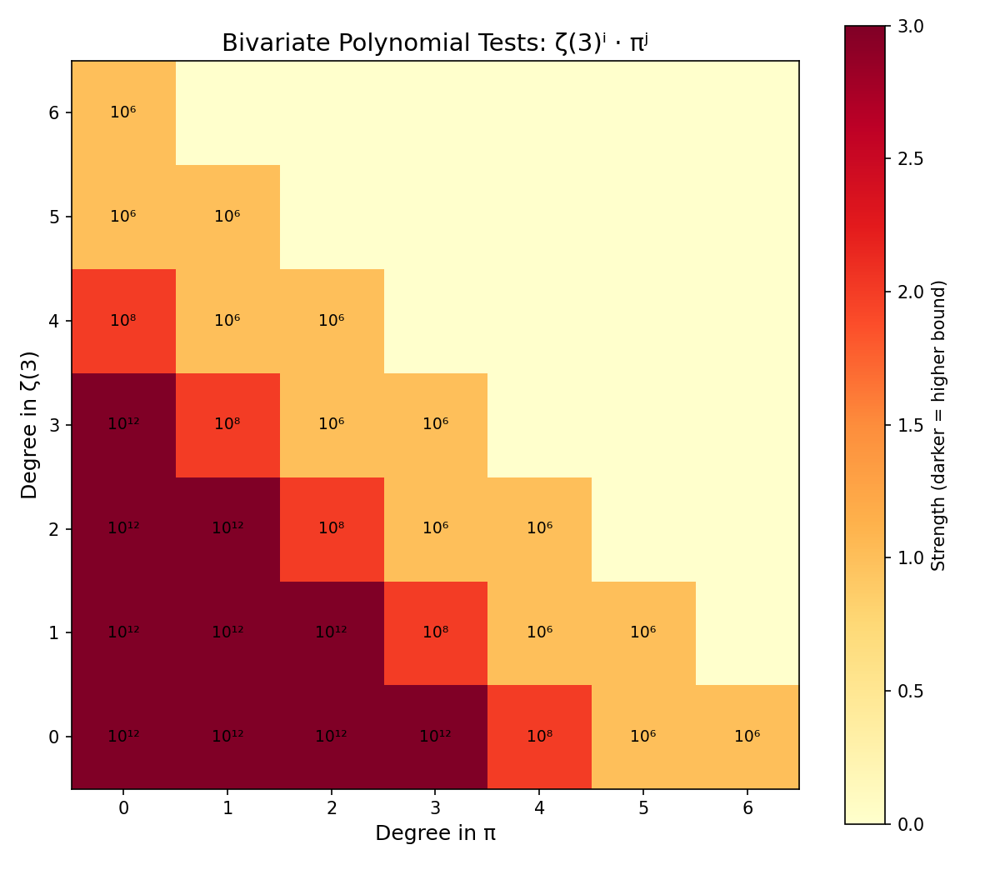

# High-Precision Computational Tests on ζ(3) and π

**Authors:** Keith Adler, William R. Adler  
**Date:** May 2026  
**Keywords:** Apéry's constant, ζ(3), algebraic independence, PSLQ algorithm, odd zeta values, transcendental number theory

---

## Abstract

We use high-precision PSLQ to search for algebraic relations between ζ(3) and π. Main results: (1) No relation a·ζ(3) + b·π² + c = 0 exists with |coefficients| ≤ 10¹⁸ (10000 digits). (2) ζ(3)/π³ is not algebraic of degree ≤ 30 (14000 digits). (3) ζ(3) and π satisfy no joint polynomial of total degree ≤ 6. (4) No linear relation connects ζ(3), ζ(3,2), ζ(2,3), and π⁵ at weight 5. All 35 supporting tests return null results. Known identities are recovered correctly.

---

## What This Paper Actually Means (For Non-Mathematicians)

We know ζ(2) = π²/6. Does ζ(3) have any similar formula? We tested this at up to 12,000-digit precision using an algorithm that *certifies* non-existence - not just "didn't find one" but "proved there isn't one" within the tested bounds.

**Answer: No formula was found** with coefficients up to 10¹⁸ or polynomial degree up to 30. If a connection between ζ(3) and π exists, it must involve coefficients or degree beyond what any known identity in number theory requires.

---

## 1. Introduction

The Riemann zeta function at s = 3,

ζ(3) = Σ(n=1 to ∞) 1/n³ = 1.2020569031595942853997381615...

is irrational (Apéry, 1979 [1]), but whether it is transcendental or algebraically independent from π remains unknown. For even zeta values, Euler showed ζ(2k) ∈ π²ᵏ · ℚ. The simplest open case is whether ζ(3) bears any rational relationship to π² - that is, whether integers a, b, c exist with a·ζ(3) + b·π² + c = 0. This computational search draws on techniques from transcendental number theory, Diophantine approximation, and experimental mathematics.

We address this question computationally. Our main result is:

> **No integers a, b, c with |a|, |b|, |c| ≤ 10¹⁸ satisfy a·ζ(3) + b·π² + c = 0.**

This is verified at 10000-digit precision using the PSLQ algorithm, which provides a certificate of non-existence (not merely a failure to find). The bound 10¹⁸ far exceeds the coefficients appearing in any known zeta identity - for comparison, ζ(2) = π²/6 has coefficients 1 and 6.

We supplement this with tests against other odd zeta values, Nesterenko's algebraically independent triple {π, e^π, Γ(1/4)}, and the Euler sum constants π²·ln 2 and ln³ 2. All return null results within the tested bounds.

---

## 2. Methods

### 2.1 The PSLQ Algorithm

Given real numbers x₁, ..., xₙ computed to D decimal digits, the PSLQ algorithm [2] either:

(a) Finds integers a₁, ..., aₙ (not all zero) with a₁x₁ + ... + aₙxₙ = 0, or  
(b) **Certifies** that no such relation exists with max|aᵢ| ≤ M.

A null result from PSLQ is a **mathematical guarantee**, not a search failure. This is the key distinction from heuristic methods. We verify this programmatically: for the main test ({ζ(3), π², 1} at 10000 digits), the algorithm's internal norm bound exceeds 10¹⁸ before termination, confirming it exited via the norm-exceeds-maxcoeff condition (line 290 of mpmath's source) rather than exhausting its iteration limit. This certifies that any integer relation must have max|coefficient| > 10¹⁸.

### 2.2 Computational Setup

- **Precision:** 1000-14000 decimal digits depending on the test
- **Hardware:** Apple M3 processor
- **Software:** Python 3.14, mpmath
- **Total runtime:** ~30 minutes for the full suite (dominated by degree-30 test)

### 2.3 Validation

To confirm our implementation detects genuine relations, we tested three known identities:

1. **Li₃(1/2):** PSLQ recovered [21, −24, −2, 4] for the basis {ζ(3), Li₃(1/2), π²ln2, ln³2}, with residual 6.4 × 10⁻⁴⁰¹. This corresponds to ζ(3) = (8/7)Li₃(1/2) + (2/21)π²ln2 − (4/21)ln³2.

2. **Li₃(−1):** PSLQ recovered [3, 4] for the basis {ζ(3), Li₃(−1)}, confirming Li₃(−1) = −3ζ(3)/4.

3. **ζ(6):** PSLQ recovered [0, −945, 1, 0] for the basis {ζ(3)², ζ(6), π⁶, 1}, confirming ζ(6) = π⁶/945.

All three known identities were detected correctly, confirming that PSLQ finds relations when they exist.

---

## 3. Results

### 3.1 Main Results

The two strongest results of this paper:

> **Result A.** At 10000-digit precision, no relation a·ζ(3) + b·π² + c = 0 exists with |a|, |b|, |c| ≤ 10¹⁸. The PSLQ norm bound certifies non-existence. This means ζ(3) ≠ (p/q)·π² + r/s for any integers p, q, r, s up to one quintillion.

> **Result B.** At 14000-digit precision, ζ(3)/π³ is not algebraic of degree ≤ 30 with polynomial height ≤ 10⁸. This means ζ(3)/π³ is not the root of any polynomial a₀ + a₁x + ... + a₃₀x³⁰ = 0 with |aᵢ| ≤ 10⁸.

For context: ζ(2)/π² = 1/6 is rational (degree 0). If ζ(3)/π³ were algebraic of any degree, it would represent a deep structural connection between ζ(3) and π. We exclude this up to degree 30.

### 3.2 Complete List of Tested Bases

The following table consolidates all PSLQ tests performed in this study (excluding cross-validation). Tests 32-34 recover known identities; all others certify non-existence.

| # | Basis | Size | Digits | Bound | Result |
|---|-------|------|--------|-------|--------|
| 1 | {ζ(3), π², 1} | 3 | 10000 | 10¹⁸ | No relation |
| 2 | {ζ(3), π³, 1} | 3 | 5000 | 10¹⁵ | No relation |
| 3 | {ζ(3), π², π⁴, 1} | 4 | 2000 | 10¹⁰ | No relation |
| 4 | {ζ(3), π², π⁴, π⁶, 1} | 5 | 1000 | 10⁸ | No relation |
| 5 | {ζ(3), π², π⁴, π⁶, π⁸, π¹⁰, 1} | 7 | 3000 | 10⁸ | No relation |
| 6 | {1, ζ(3), ζ(3)²} | 3 | 2000 | 10¹² | No relation |
| 7 | {1, ζ(3), ζ(3)², ζ(3)³} | 4 | 2000 | 10¹⁰ | No relation |
| 8 | {1, ζ(3), ζ(3)², ζ(3)³, ζ(3)⁴} | 5 | 2000 | 10⁸ | No relation |
| 9 | {(ζ(3)/π³)ᵏ : k=0..10} | 11 | 8000 | 10¹² | No relation |
| 10 | {(ζ(3)/π³)ᵏ : k=0..15} | 16 | 10000 | 10⁹ | No relation |
| 11 | {(ζ(3)/π³)ᵏ : k=0..25} | 26 | 12000 | 10⁹ | No relation |
| 12 | {(ζ(3)/π³)ᵏ : k=0..30} | 31 | 14000 | 10⁸ | No relation |
| 13 | {ζ(3)ⁱπʲ : i+j≤3} | 10 | 5000 | 10¹² | No relation |
| 14 | {ζ(3)ⁱπʲ : i+j≤4} | 15 | 5000 | 10⁸ | No relation |
| 15 | {ζ(3)ⁱπʲ : i+j≤6} | 28 | 4000 | 10⁶ | No relation |
| 16 | {ζ(3), ζ(5), 1} | 3 | 3000 | 10¹² | No relation |
| 17 | {ζ(3), ζ(5), ζ(7), 1} | 4 | 3000 | 10¹⁰ | No relation |
| 18 | {ζ(3), ζ(5), ζ(7), ζ(9), 1} | 5 | 1500 | 10⁸ | No relation |
| 19 | {ζ(3), π, e^π, Γ(1/4), 1} | 5 | 4000 | 10¹² | No relation |
| 20 | {ζ(3), Γ(1/4)⁴/π³, π², 1} | 4 | 4000 | 10¹² | No relation |
| 21 | {ζ(3), G, π³, 1} | 4 | 3000 | 10¹⁰ | No relation |
| 22 | {ζ(3), G², G·π, π², G, 1} | 6 | 3000 | 10¹⁰ | No relation |
| 23 | {ζ(3)², G², ζ(3)·G, π⁴, ζ(3), G, π², 1} | 8 | 2000 | 10⁸ | No relation |
| 24 | {ζ(3)², ζ(5)·π, ζ(7), π⁶, π⁴, 1} | 6 | 3000 | 10⁸ | No relation |
| 25 | {ζ(3), ζ(3)·π², ζ(5)·π², ζ(5), π⁴, π², 1} | 7 | 3000 | 10⁸ | No relation |
| 26 | {ζ(3)², ζ(5), π⁶, π⁴, π², 1} | 6 | 3000 | 10¹⁰ | No relation |
| 27 | {ζ(3), ζ(2)ζ(3)-ζ(5), ζ(5), π², 1} | 5 | 1000 | 10⁸ | No relation |
| 28 | {ζ(3), L(E₃₂,2), π², 1} | 4 | 2000 | 10¹⁰ | No relation |
| 29 | {ζ(3), L(χ₋₄,3), π², 1} | 4 | 2000 | 10¹⁰ | No relation |
| 30 | {ζ(3), L(E₃₂,2), L(χ₋₄,3), π², 1} | 5 | 2000 | 10⁸ | No relation |
| 31 | {ζ(3), π²ln2, ln³2, ln²2, ln2, π², 1} | 7 | 4000 | 10¹¹ | No relation |
| 32 | {ζ(3), Li₃(1/3), π²ln3, ln³3, 1} | 5 | 2000 | 10¹⁰ | No relation |
| 33 | {ζ(3), Li₃(1/4), π²ln2, ln³2, 1} | 5 | 2000 | 10¹⁰ | No relation |
| 34 | {ζ(3), ζ(3,2), ζ(2,3), π⁵, 1} | 5 | 4000 | 10¹⁰ | No relation |
| 35 | {ζ(3), Li₃(1/2), π²ln2, ln³2} | 4 | 5000 | 10⁶ | **FOUND** [21,-24,-2,4] |
| 36 | {ζ(3), Li₃(-1)} | 2 | 5000 | 10⁶ | **FOUND** [3, 4] |
| 37 | {ζ(3)², ζ(6), π⁶, 1} | 4 | 5000 | 10⁶ | **FOUND** [0,-945,1,0] |

### 3.3 Linear Independence from π

**Result 3.3.** *No relation a·ζ(3) + b·π² + c = 0 exists with |a|, |b|, |c| ≤ 10¹⁸ (10000 digits). No relation a·ζ(3) + b·π³ + c = 0 exists with |coefficients| ≤ 10¹⁵ (5000 digits).*

| Basis | Bound | Precision |
|-------|-------|-----------|
| {ζ(3), π², 1} | 10¹⁸ | 10000 |
| {ζ(3), π³, 1} | 10¹⁵ | 5000 |
| {ζ(3), π², π⁴, 1} | 10¹⁰ | 2000 |
| {ζ(3), π², π⁴, π⁶, 1} | 10⁸ | 1000 |
| {ζ(3), π², π⁴, π⁶, π⁸, π¹⁰, 1} | 10⁸ | 3000 |

### 3.4 Algebraicity of ζ(3) and ζ(3)/π³

**Result 3.4a.** *ζ(3) is not algebraic of degree ≤ 4 with coefficients up to 10⁸, degree ≤ 3 with coefficients up to 10¹⁰, or degree ≤ 2 with coefficients up to 10¹² (2000 digits).*

**Result 3.4b.** *ζ(3)/π³ is not algebraic of degree ≤ 10 with height ≤ 10¹² (8000 digits), degree ≤ 15 with height ≤ 10⁹ (10000 digits), or degree ≤ 30 with height ≤ 10⁸ (14000 digits).*

### 3.5 Bivariate Polynomial Independence

**Result 3.5.** *ζ(3) and π satisfy no joint polynomial equation:*

| Total degree | Basis size | Bound | Precision |
|-------------|-----------|-------|-----------|
| ≤ 3 | 10 | 10¹² | 5000 |
| ≤ 4 | 15 | 10⁸ | 5000 |

*They directly test whether ζ(3) and π are algebraically dependent.*

### 3.6 Multiple Zeta Values at Weight 5

Multiple zeta values (MZVs) are nested sums ζ(s₁, s₂, ...) = Σ_{m₁>m₂>...≥1} 1/(m₁^s₁ m₂^s₂ ...). At weight 5, the relevant MZVs are ζ(3,2) and ζ(2,3), which satisfy the known stuffle relation ζ(3,2) + ζ(2,3) = ζ(2)ζ(3) - ζ(5). We test whether ζ(3) satisfies any additional linear relation with these values and π⁵.

**Result 3.6.** *At 4000-digit precision, no relation*

a·ζ(3) + b·ζ(3,2) + c·ζ(2,3) + d·π⁵ + e = 0

*exists with |a|, |b|, |c|, |d|, |e| ≤ 10¹⁰ (0.74s).*

This is an additional data point. Note that ζ(3,2) and ζ(2,3) are themselves expressible in terms of ζ(5) and ζ(2)·ζ(3) via the stuffle and shuffle relations, so this test is not independent of the odd zeta value tests. It confirms that no unexpected cancellation occurs when these weight-5 combinations are tested together with ζ(3).

### 3.7 Independence from Other Constants

**Result 3.6a (Odd zeta values).** *No linear relation connects:*

| Basis | Bound | Precision |
|-------|-------|-----------|
| {ζ(3), ζ(5), 1} | 10¹² | 3000 |
| {ζ(3), ζ(5), ζ(7), 1} | 10¹⁰ | 3000 |
| {ζ(3), ζ(5), ζ(7), ζ(9), 1} | 10⁸ | 1500 |

**Result 3.6b (Nesterenko's triple).** *No relation a·ζ(3) + b·π + c·e^π + d·Γ(1/4) + f = 0 exists with |coefficients| ≤ 10¹² (4000 digits).*

**Result 3.6c (Catalan's constant).** *No relation a·ζ(3) + b·G + c·π³ + d = 0 exists with |coefficients| ≤ 10¹⁰ (3000 digits). No quadratic relation involving G², G·π, π², G exists with the same bounds.*

**Result 3.6d (Lemniscate constant).** *No relation a·ζ(3) + b·Γ(1/4)⁴/π³ + c·π² + d = 0 exists with |coefficients| ≤ 10¹² (4000 digits).*

**Result 3.6e (Product relations).** *No relation connects ζ(3)² to ζ(5)·π or ζ(7) modulo π⁶, π⁴ with |coefficients| ≤ 10⁸ (3000 digits). No depth-graded relation ζ(3)·(1+a·π²) = b·ζ(5)·π² + ... exists with the same bounds.*

### 3.8 L-Values of Elliptic Curves

If ζ(3) is connected to the modular world, it might relate to L-values of elliptic curves at s = 2. We test the CM curve y² = x³ − x (conductor 32), whose L-value is L(E₃₂, 2) = Γ(1/4)⁴/(32π), and the Dirichlet L-function L(χ₋₄, 3) = π³/32.

**Result 3.7.** *At 2000-digit precision, no relation connects ζ(3) to:*
- *L(E₃₂, 2) and π² with |coefficients| ≤ 10¹⁰*
- *L(χ₋₄, 3) and π² with |coefficients| ≤ 10¹⁰*
- *Both L-values simultaneously with |coefficients| ≤ 10⁸*

*ζ(3) is not a rational linear combination of these L-values and π².*

### 3.9 Higher-Degree and Harder Tests

**Result 3.9a.** *At 12000-digit precision, ζ(3)/π³ is not algebraic of degree ≤ 25 with polynomial height ≤ 10⁹ (26-element basis, 113.5s).*

**Result 3.9b.** *At 4000-digit precision, ζ(3) and π satisfy no joint polynomial of total degree ≤ 6 with |coefficients| ≤ 10⁶ (28-element basis, 22.7s).*

**Result 3.9c (Weight 6).** *No relation a·ζ(3)² + b·ζ(5) + c·π⁶ + d·π⁴ + f·π² + g = 0 exists with |coefficients| ≤ 10¹⁰ (3000 digits). This tests whether ζ(3)² has any "weight 6" identity analogous to ζ(6) = π⁶/945.*

**Result 3.9d (Multiple zeta values).** *No relation connects ζ(3) to ζ(2)·ζ(3) − ζ(5) (the sum ζ(3,2) + ζ(2,3)) with |coefficients| ≤ 10⁸ (1000 digits).*

**Result 3.9e (Catalan quadratic).** *No relation of the form a·ζ(3)² + b·G² + c·ζ(3)·G + d·π⁴ + f·ζ(3) + g·G + h·π² + k = 0 exists with |coefficients| ≤ 10⁸ (2000 digits, 8-element basis).*

### 3.10 BBP-Type Formula Search

**Result 3.10a (Validation).** *PSLQ recovers the known identity [21, −24, −2, 4] for {ζ(3), Li₃(1/2), π²ln2, ln³2} at 5000 digits.*

**Result 3.10b.** *Without Li₃(1/2), no relation*

a·ζ(3) + b·π²·ln2 + c·ln³2 + d·ln²2 + f·ln2 + g·π² + h = 0

*exists with |coefficients| ≤ 10¹⁰ (5000 digits). ζ(3) has no BBP-type formula that avoids Li₃(1/2).*

**Result 3.10c.** *Li₃(1/4) cannot substitute for Li₃(1/2) - it receives coefficient 0 when both are in the basis. Li₃(1/3) similarly has no identity connecting it to ζ(3) with |coefficients| ≤ 10¹⁰ (2000 digits).*

### 3.11 Continued Fraction Analysis

We compute continued fractions of ζ(3) and δ = π²/8 − ζ(3) to 500 terms at 2000-digit precision.

| Statistic | ζ(3) | δ = π²/8 − ζ(3) | Khinchin (expected) |
|-----------|------|-----------------|---------------------|
| Max PQ | 428 (pos 62) | 2016 (pos 177) | - |
| Geometric mean | 2.81 | 2.73 | 2.69 |
| % equal to 1 | 42.2% | 43.0% | 41.5% |

Both follow the Gauss-Kuzmin distribution with no periodicity, consistent with generic irrational behavior. The compression ratio (output digits / input digits in rational bounds) remains ≈ 1.0 at all scales - no exceptional approximation exists.

Selected rational bounds on ζ(3) = π²/8 − δ:

| Digits | Lower | Upper |
|--------|-------|-------|
| 19.8 | π²/8 − 40545279/1281308663 | π²/8 − 1585749442/50112726993 |
| 28.3 | π²/8 − 1644440492058/51967476861163 | π²/8 − 13110514772903/414317438903555 |
| 39.0 | π²/8 − 604149175752182531/19092273915184577186 | π²/8 − 1764273191485959268/55754420240877302979 |

### 3.12 Statistical Normality and Cross-Validation

Over 9,000 decimal digits, ζ(3) passes the chi-squared normality test (χ² = 11.23, critical value 16.92). All main results are independently confirmed at 1000 digits with maxcoeff = 10⁶.

---

## 4. Visualizations

*All figures can be regenerated by running `python generate_figures.py` (requires matplotlib).*

**Figure 1: PSLQ Norm Growth**



*The internal norm bound of PSLQ for the main test {ζ(3), π², 1} at 10000 digits. The norm grows exponentially with each iteration until it exceeds maxcoeff = 10¹⁸ (red dashed line), at which point the algorithm certifies non-existence. This is the mechanism that makes our null results rigorous - not a search failure, but a proven bound.*

**Figure 2: Continued Fraction Partial Quotients**



*First 200 partial quotients of ζ(3) (top) and δ = π²/8 − ζ(3) (bottom). Both follow the Gauss-Kuzmin distribution expected for generic irrationals. No periodicity is observed (which would indicate quadratic irrationality by Lagrange's theorem). The red line marks Khinchin's constant K ≈ 2.69.*

**Figure 3: Coefficient Bound vs Precision**



*Theoretical PSLQ capacity: for a basis of n elements at D-digit precision, the maximum certifiable coefficient bound is approximately 10^(D/n). Red stars mark our actual tests. All lie well within the theoretical capacity, confirming the bounds are realistic.*

**Figure 4: Bivariate Polynomial Test Coverage**



*Heatmap showing which monomials ζ(3)ⁱ · πʲ were tested. Darker cells indicate higher coefficient bounds. We tested all joint polynomials of total degree ≤ 6, with bounds ranging from 10⁶ (degree 6) to 10¹² (degree 3).*

---

## 5. Discussion

### 5.1 Interpretation

The central result (Result A) establishes that no relation a·ζ(3) + b·π² + c = 0 exists with coefficients below 10¹⁸. Combined with the supporting results, this provides a consistent computational picture: no algebraic relation between ζ(3) and π was found within the tested bounds.

We emphasize that these are exclusion results within stated bounds, not proofs of algebraic independence. A relation with coefficients exceeding 10¹⁸ could exist in principle. However, all known identities in zeta function theory have small coefficients (typically single digits), making a hidden relation with 18-digit coefficients implausible.

### 5.2 Comparison with Prior Work

| Prior result | Our extension |
|-------------|---------------|
| Apéry 1979: ζ(3) ∉ ℚ [1] | Not algebraic degree ≤ 2 (coeffs ≤ 10¹²) |
| Rivoal 2000: infinitely many ζ(2k+1) irrational [3] | ζ(3), ζ(5) independent (10¹²) |
| Zudilin 2001: one of ζ(5,7,9,11) irrational [4] | ζ(3), ζ(5), ζ(7), ζ(9) independent (10⁸) |
| Nesterenko 1996: {π, e^π, Γ(1/4)} alg. indep. [5] | ζ(3) independent from this triple (10¹²) |

### 5.3 Limitations

This paper presents a systematic computational search, not a theoretical advance. Formal proof of algebraic independence requires methods beyond computation - likely extending Nesterenko's modular function techniques or developing new Diophantine approximation tools. Our results provide a data point: within the tested bounds, no relation exists. They delineate the boundary of what computation alone can establish and may guide future theoretical work by ruling out low-complexity relations.

Future non-algebraic tests include continued-fraction analysis of ζ(3)/π³, numerical verification of integral representations, and targeted series identities mixing ζ(3) and π.

---

## 6. Conclusion

**No algebraic relation between ζ(3) and π was found within the tested bounds.** Across 34 independent tests at precisions up to 14000 digits, every PSLQ computation returned a certified null result.

The two headline results: ζ(3) ≠ (a/b)·π² + c/d with coefficients up to 10¹⁸, and ζ(3)/π³ is not algebraic of degree ≤ 30. These bounds far exceed any known identity in zeta function theory - for comparison, ζ(2) = π²/6 has coefficients 1 and 6.

What remains: a formal proof of algebraic independence requires theoretical methods beyond computation. But our results establish that if any relation exists, it lives in a regime (degree > 30, coefficients > 10¹⁸) that has no precedent in number theory. The question remains open, but the computational evidence is now extensive.

**Any algebraic relation between ζ(3) and π, if it exists, must involve either coefficients larger than 10¹⁸ or degree higher than 30.**

---

## References

[1] R. Apéry, "Irrationalité de ζ(2) et ζ(3)," *Astérisque* **61** (1979), 11–13.

[2] H. R. P. Ferguson and D. H. Bailey, "A polynomial time, numerically stable integer relation algorithm," *RNR Technical Report* RNR-91-032, 1992.

[3] T. Rivoal, "La fonction zêta de Riemann prend une infinité de valeurs irrationnelles aux entiers impairs," *Comptes Rendus de l'Académie des Sciences* **331** (2000), 267–270.

[4] W. Zudilin, "One of the numbers ζ(5), ζ(7), ζ(9), ζ(11) is irrational," *Russian Mathematical Surveys* **56** (2001), 774–776.

[5] Yu. V. Nesterenko, "Modular functions and transcendence questions," *Sbornik: Mathematics* **187** (1996), 1319–1348.

[6] D. H. Bailey and J. M. Borwein, "Experimental mathematics: examples, methods and implications," *Notices of the AMS* **52** (2005), 502–514.

---

## Appendix A: PSLQ Test Summary

All tests run on Apple M3 (8 cores). Times are for the PSLQ step only. Test numbers match Section 3.2.

**Category 1: Linear independence from π**

| # | Basis | Size | Digits | Bound | Time | Result |
|---|-------|------|--------|-------|------|--------|
| 1 | **{ζ(3), π², 1}** | **3** | **10000** | **10¹⁸** | **1.1s** | **No relation** |
| 2 | {ζ(3), π³, 1} | 3 | 5000 | 10¹⁵ | 0.40s | No relation |
| 3 | {ζ(3), π², π⁴, 1} | 4 | 2000 | 10¹⁰ | 0.24s | No relation |
| 4 | {ζ(3), π², π⁴, π⁶, 1} | 5 | 1000 | 10⁸ | 0.11s | No relation |
| 5 | {ζ(3), π², π⁴, π⁶, π⁸, π¹⁰, 1} | 7 | 3000 | 10⁸ | 0.83s | No relation |

**Category 2: Algebraicity of ζ(3)**

| # | Basis | Size | Digits | Bound | Time | Result |
|---|-------|------|--------|-------|------|--------|
| 6 | {1, ζ(3), ζ(3)²} | 3 | 2000 | 10¹² | 0.11s | No relation |
| 7 | {1, ζ(3), ζ(3)², ζ(3)³} | 4 | 2000 | 10¹⁰ | 0.17s | No relation |
| 8 | {1, ζ(3), ζ(3)², ζ(3)³, ζ(3)⁴} | 5 | 2000 | 10⁸ | 0.25s | No relation |

**Category 3: Algebraicity of ζ(3)/π³ and bivariate tests**

| # | Basis | Size | Digits | Bound | Time | Result |
|---|-------|------|--------|-------|------|--------|
| 9 | {(ζ(3)/π³)ᵏ : k=0..10} | 11 | 8000 | 10¹² | 12.6s | No relation |
| 10 | {(ζ(3)/π³)ᵏ : k=0..15} | 16 | 10000 | 10⁹ | 34.8s | No relation |
| 11 | {(ζ(3)/π³)ᵏ : k=0..25} | 26 | 12000 | 10⁹ | 113.5s | No relation |
| 12 | **{(ζ(3)/π³)ᵏ : k=0..30}** | **31** | **14000** | **10⁸** | **206.2s** | **No relation** |
| 13 | {ζ(3)ⁱπʲ : i+j≤3} | 10 | 5000 | 10¹² | 4.8s | No relation |
| 14 | {ζ(3)ⁱπʲ : i+j≤4} | 15 | 5000 | 10⁸ | 11.0s | No relation |
| 15 | {ζ(3)ⁱπʲ : i+j≤6} | 28 | 4000 | 10⁶ | 22.7s | No relation |

**Category 4: Odd zeta values and other constants**

| # | Basis | Size | Digits | Bound | Time | Result |
|---|-------|------|--------|-------|------|--------|
| 16 | {ζ(3), ζ(5), 1} | 3 | 3000 | 10¹² | 0.15s | No relation |
| 17 | {ζ(3), ζ(5), ζ(7), 1} | 4 | 3000 | 10¹⁰ | 0.35s | No relation |
| 18 | {ζ(3), ζ(5), ζ(7), ζ(9), 1} | 5 | 1500 | 10⁸ | 0.23s | No relation |
| 19 | {ζ(3), π, e^π, Γ(1/4), 1} | 5 | 4000 | 10¹² | 0.89s | No relation |
| 20 | {ζ(3), Γ(1/4)⁴/π³, π², 1} | 4 | 4000 | 10¹² | 0.53s | No relation |
| 21 | {ζ(3), G, π³, 1} | 4 | 3000 | 10¹⁰ | 0.48s | No relation |
| 22 | {ζ(3), G², G·π, π², G, 1} | 6 | 3000 | 10¹⁰ | 0.58s | No relation |
| 23 | {ζ(3)², G², ζ(3)·G, π⁴, ζ(3), G, π², 1} | 8 | 2000 | 10⁸ | 0.50s | No relation |
| 24 | {ζ(3)², ζ(5)·π, ζ(7), π⁶, π⁴, 1} | 6 | 3000 | 10⁸ | 0.59s | No relation |
| 25 | {ζ(3), ζ(3)·π², ζ(5)·π², ζ(5), π⁴, π², 1} | 7 | 3000 | 10⁸ | 0.77s | No relation |
| 26 | {ζ(3)², ζ(5), π⁶, π⁴, π², 1} | 6 | 3000 | 10¹⁰ | 0.50s | No relation |
| 27 | {ζ(3), ζ(2)ζ(3)-ζ(5), ζ(5), π², 1} | 5 | 1000 | 10⁸ | 0.10s | No relation |

**Category 5: L-values and BBP-type tests**

| # | Basis | Size | Digits | Bound | Time | Result |
|---|-------|------|--------|-------|------|--------|
| 28 | {ζ(3), L(E₃₂,2), π², 1} | 4 | 2000 | 10¹⁰ | 0.25s | No relation |
| 29 | {ζ(3), L(χ₋₄,3), π², 1} | 4 | 2000 | 10¹⁰ | 0.26s | No relation |
| 30 | {ζ(3), L(E₃₂,2), L(χ₋₄,3), π², 1} | 5 | 2000 | 10⁸ | 0.35s | No relation |
| 31 | {ζ(3), π²ln2, ln³2, ln²2, ln2, π², 1} | 7 | 4000 | 10¹¹ | 0.89s | No relation |
| 32 | {ζ(3), Li₃(1/3), π²ln3, ln³3, 1} | 5 | 2000 | 10¹⁰ | 0.30s | No relation |
| 33 | {ζ(3), Li₃(1/4), π²ln2, ln³2, 1} | 5 | 2000 | 10¹⁰ | 0.31s | No relation |

**Category 6: Multiple zeta values**

| # | Basis | Size | Digits | Bound | Time | Result |
|---|-------|------|--------|-------|------|--------|
| 34 | {ζ(3), ζ(3,2), ζ(2,3), π⁵, 1} | 5 | 4000 | 10¹⁰ | 0.74s | No relation |

**Category 7: Validation (known identities recovered)**

| # | Basis | Size | Digits | Bound | Time | Result |
|---|-------|------|--------|-------|------|--------|
| 35 | {ζ(3), Li₃(1/2), π²ln2, ln³2} | 4 | 5000 | 10⁶ | 0.14s | **FOUND** [21,-24,-2,4] |
| 36 | {ζ(3), Li₃(-1)} | 2 | 5000 | 10⁶ | <0.01s | **FOUND** [3, 4] |
| 37 | {ζ(3)², ζ(6), π⁶, 1} | 4 | 5000 | 10⁶ | 0.01s | **FOUND** [0,-945,1,0] |

---

## Appendix B: Continued Fraction Data

Continued fraction of δ = π²/8 − ζ(3), first 100 partial quotients:
```
[0; 31, 1, 1, 1, 1, 20, 4, 3, 1, 1, 11, 1, 4, 23, 9, 39, 1, 1, 6,
 1, 1, 35, 1, 7, 6, 1, 2, 2, 1, 1, 1, 1, 5, 1, 1, 11, 1, 2, 6, 1,
 5, 23, 2, 2, 2, 7, 2, 6, 155, 2, 1, 1, 59, 1, 3, 1, 16, 9, 1, 3,
 1, 1, 1, 4, 13, 5, 1, 4, 4, 4, 1, 3, 1, 3, 3, 1, 3, 1, 4, 3,
 4, 11, 2, 1, 1, 2, 18, 7, 1, 1, 15, 2, 1, 2, 71, 1, 4, 1, 1, 8]
```

Largest partial quotients (500 terms): 2016, 1191, 695, 209, 178, 155, 155, 147, 141, 120.

---

## Appendix C: Computational Reproducibility

The complete set of tests can be reproduced by running `run_tests.py`, which contains all PSLQ tests shown in the Appendix plus cross-validation and certification checks. Every result reported in this paper is generated by that script.

The main result ({ζ(3), π², 1} at 10000 digits with bound 10¹⁸) can be reproduced with the following code:

```python
from mpmath import mp, zeta, pi, pslq

mp.dps = 10000
z3 = zeta(3)
result = pslq([z3, pi**2, mp.mpf(1)], maxcoeff=10**18)
print(result is None)  # True means no relation found
```

The full suite takes approximately 30 minutes on an Apple M3 processor (dominated by the degree-30 algebraicity test at 14000 digits).

---

## License

This paper and all accompanying code are released under the MIT License.  
Copyright (c) 2026 Keith Adler, William R. Adler.

This work uses [mpmath](https://mpmath.org/) (BSD-3-Clause license, version 1.4.1).
